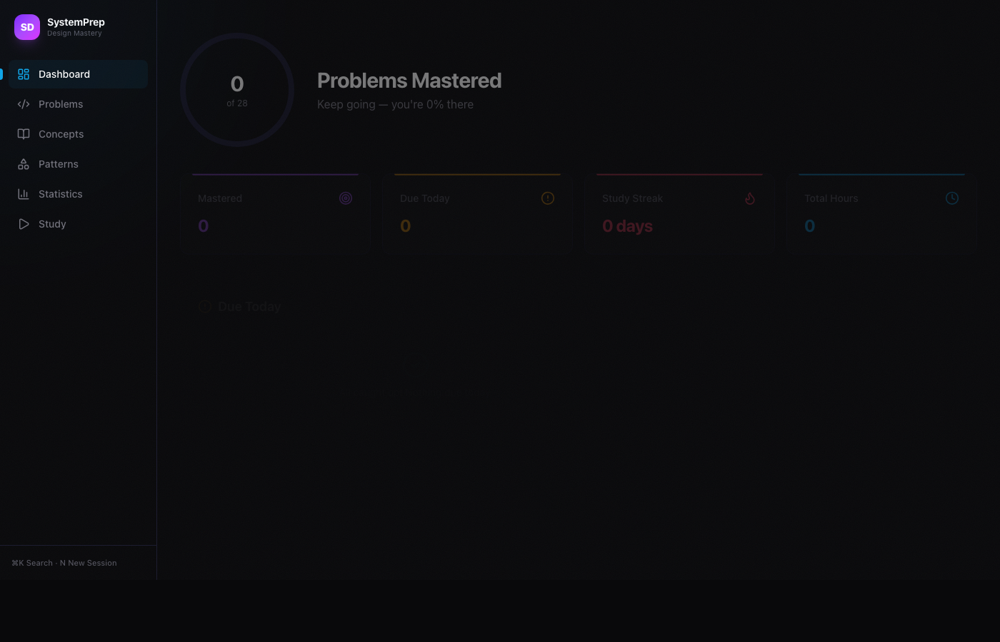
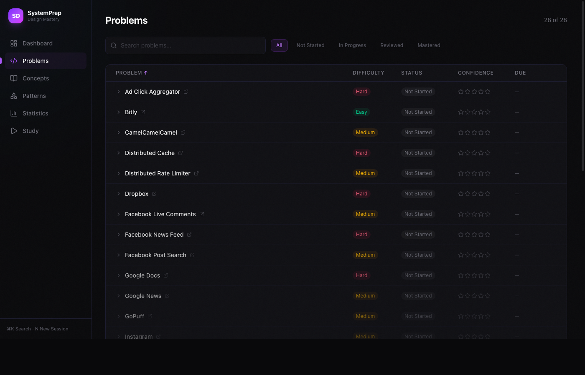
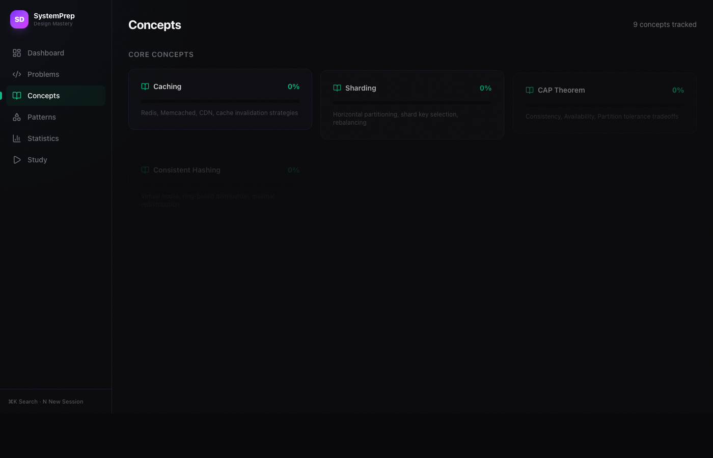
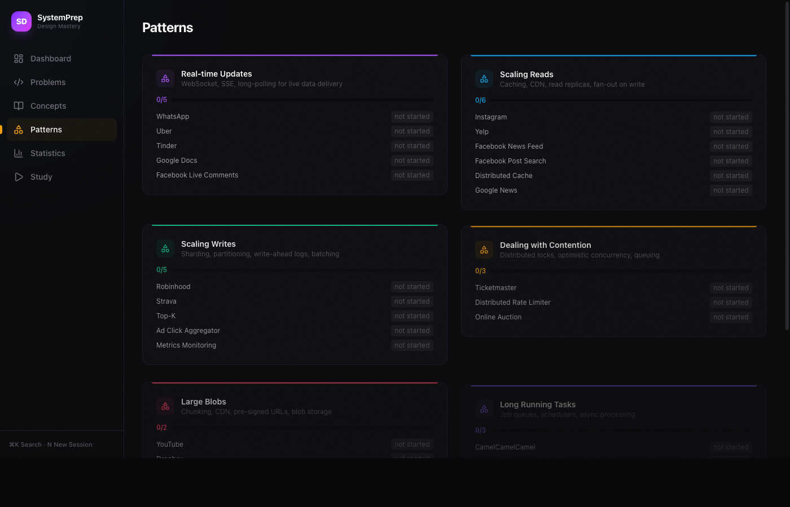
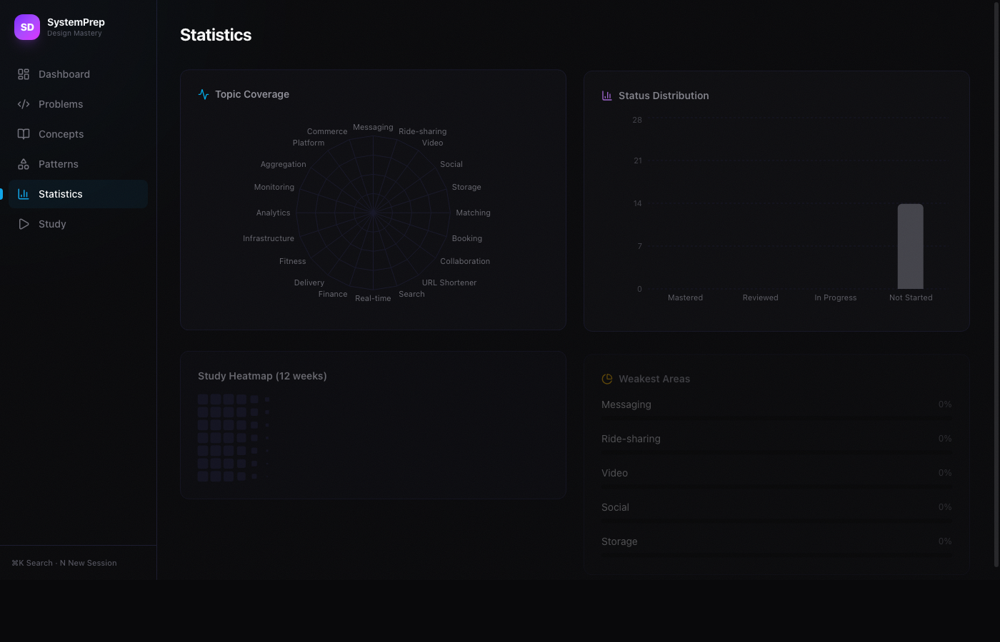

# 📐 SystemPrep — Design Mastery

> A premium system design interview prep tracker with SM-2 spaced repetition

[](https://react.dev)
[](https://typescriptlang.org)
[](https://tailwindcss.com)
[](https://www.framer.com/motion/)

## Screenshots

### Dashboard


### Problems — 28 System Design Breakdowns


### Core Concepts


### Design Patterns


### Statistics & Heatmap


### Study Session — Focused Mode


## Features

- 📋 **28 System Design Problems** — WhatsApp, Uber, YouTube, Instagram, Dropbox, Ticketmaster, Google Docs, and more
- 🧠 **SM-2 Spaced Repetition** — Rate confidence 1-5, auto-schedules next review
- ⏱️ **Timed Study Sessions** — Full-screen focus mode with auto-pick
- 📚 **9 Core Concepts** — Caching, Sharding, CAP Theorem, Consistent Hashing, etc.
- 🔄 **7 Design Patterns** — Real-time Updates, Scaling Reads/Writes, Contention, etc.
- 📈 **Statistics** — Study heatmap, radar chart, confidence distribution, weakest areas
- ⌨️ **Keyboard Shortcuts** — `⌘K` search, `N` new session
- 🎮 **Easter Egg** — Konami code (↑↑↓↓←→←→BA)
- 🖱️ **Micro-interactions** — 3D tilt on hover, animated counters, staggered transitions
- 💾 **Offline** — All data in localStorage, no backend needed

## Premium Design

- Near-black base (#09090b) with noise texture overlay
- Animated gradient orb follows mouse cursor
- 3D perspective tilt on card hover
- Linear-style sliding sidebar indicator
- Framer Motion page transitions
- Pulsing glow on "due today" indicators
- Custom dark scrollbars
- Toast notifications

## Tech Stack

- **React 18** + **TypeScript**
- **Vite** — Lightning fast dev server
- **Tailwind CSS v4** — Utility-first styling
- **Framer Motion** — Animations & transitions
- **Recharts** — Charts & visualizations
- **Lucide React** — Icons

## Getting Started

```bash
git clone https://github.com/Sanjays2402/interview-prep-tracker.git
cd interview-prep-tracker
npm install
npm run dev
```

Open [http://localhost:5173](http://localhost:5173)

## How It Works

### Spaced Repetition (SM-2)

After studying a problem, rate your confidence:

| Rating | Next Review |
|--------|-------------|
| ⭐ 1-2 | Tomorrow |
| ⭐ 3 | 3 days |
| ⭐ 4 | 7 days × multiplier |
| ⭐ 5 | 14 days × multiplier |

The interval multiplier increases with consecutive good reviews, spacing out reviews as you master topics.

## Author

Built by **Sanjay Santhanam** with 🥔
